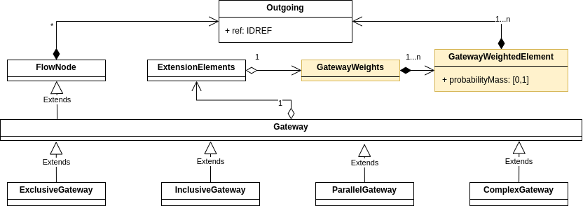

# Stochastic BPMN
A Stochastic BPMN package for the [ProM-Framework](https://github.com/promworkbench/ProM-Framework).


## Usage 
### In ProM
#### Import
Just drag-n-drop the .bpmn file (extended with stochastic data) in ProM and select the `Stochastic BPMN 2.0 files (Diagram)` plugin for import. This will select the first diagram listed in the BPMN file.

You can also drag-n-drop `.pnml` (SPN) file and read it as a `StochasticBPMNDiagram` with the `Stochastic net files` import plugin.

If you want to select the diagram yourself use the `Stochastic BPMN 2.0 files` import plugin, and the use the `Select Stochastic BPMN Diagram` to select the desired diagram.
#### Conversion from SPN
Use the `Convert Stochastic Petri net to Stochastic BPMN model` plugin.
### Java
#### Import
###### Reading SBPMN from .bpmn file
According to the BPMN specification, each file might contain one or more diagrams. The following code is the simplest and will read the first diagram that encounters (first listed in the XML document).
```java
StochasticBPMNDiagram sbpmnDiagram = StochasticBPMNDiagramReader.fromFile().read(file);
```
Additionally, there are convinience methods that can help you read from `InputStream` and from `FileName`, see [StochasticBPMNDiagramReader](https://github.com/promworkbench/StochasticBPMN/blob/main/src/org/processmining/stochasticbpmn/algorithms/reader/StochasticBPMNReader.java) definition for more details.

If you want to select a specific diagram then you have to use the intermidiate representation `StochasticBpmn` which is exact replica of the file structure in java classes (not a diagram). Then, you can specify which diagram you want to be extracted.
```java
    StochasticBpmn sbpm = StochasticBPMNReader.fromFile().read(file);
    StochasticBPMNDiagram diagram = StochasticBPMNDiagramBuilder.getInstance().build(sbpmn, label, selectDiagramParameters);
```
For more details see [StochasticBPMNReader](https://github.com/promworkbench/StochasticBPMN/blob/main/src/org/processmining/stochasticbpmn/algorithms/reader/StochasticBPMNReader.java) and [StochasticBPMNDiagramBuilder](https://github.com/promworkbench/StochasticBPMN/blob/main/src/org/processmining/stochasticbpmn/algorithms/diagram/builder/StochasticBPMNDiagramBuilderImpl.java).

We also provide similar convenience reading classes for normal BPMN models (see [BPMNDiagramReader](https://github.com/promworkbench/StochasticBPMN/blob/main/src/org/processmining/stochasticbpmn/algorithms/diagram/reader/BpmnDiagramReader.java))

###### Reading SBPMN directly from SPN
To read Stochastic Petri Net (SPN) directly from a `.pnml` file.

```
StochasticBPMNDiagram diagram = StochasticBPMNDiagramFromSPNReader.fromFile().read(file);
```

Note that Peti nets always represent one diagram.
## Stochastic BPMN
In this work we define a formal definition as well as schema extension of the [BPMN 2.0.2 Specification](https://www.omg.org/spec/BPMN/2.0.2/PDF/)
### Schema Extension
Our schema allows for assigning weight to any subset of outgoing sequence flows of any gateway (See [BPMN Stochastic Extension Schema](resources/inputModel/StochasticBPMN/XMLSchema/BPMN_StochasticExtension.xsd)).


### Examples
- [Handling of Compensation Requests](https://github.com/promworkbench/StochasticBPMN/blob/main/resources/inputModel/StochasticBPMN/example/Instance%20-%20BPMN%20-%20Handling%20of%20Compensation%20Requests%20Simplified.bpmn) depicted on the first figure avobe.
- [rtfm_IMf02_ABE](https://github.com/promworkbench/StochasticBPMN/blob/main/resources/inputModel/StochasticBPMN/example/Instance%20-%20Stochastic%20BPMN%20-%20rtfm_IMf02_ABE.bpmn) discovered model from the [Road Traffic Fine Management Event Log](https://data.4tu.nl/articles/dataset/Road_Traffic_Fine_Management_Process/12683249), using [Inductive Miner (IMf02)](https://github.com/promworkbench/InductiveMiner) with threshold of 0.2, in combination with [Alignment-Based Estimator (ABE)](https://github.com/promworkbench/StochasticWeightEstimation), finally converted from SPN into SBPMN.